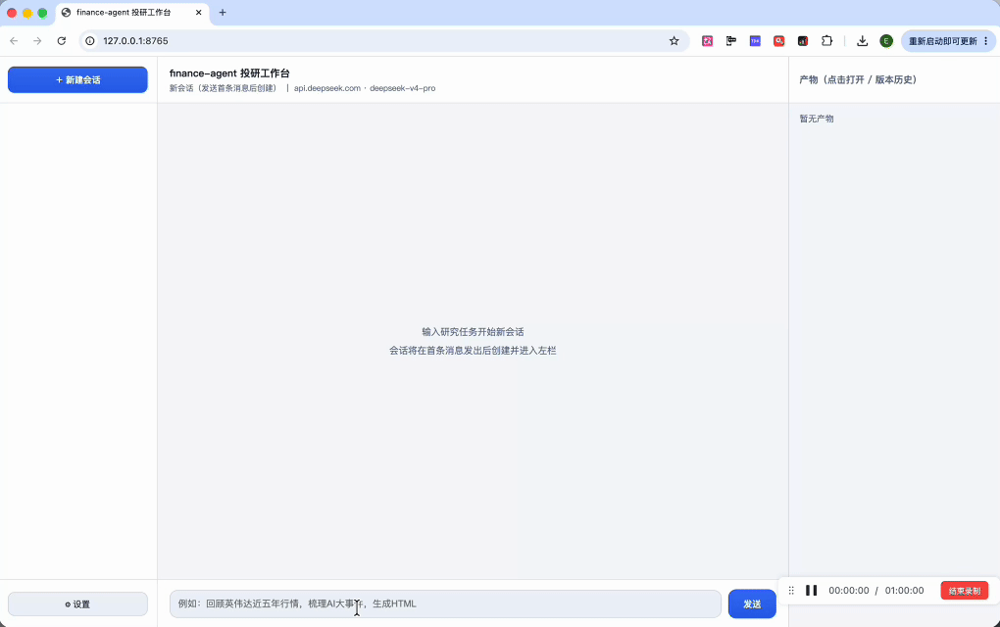
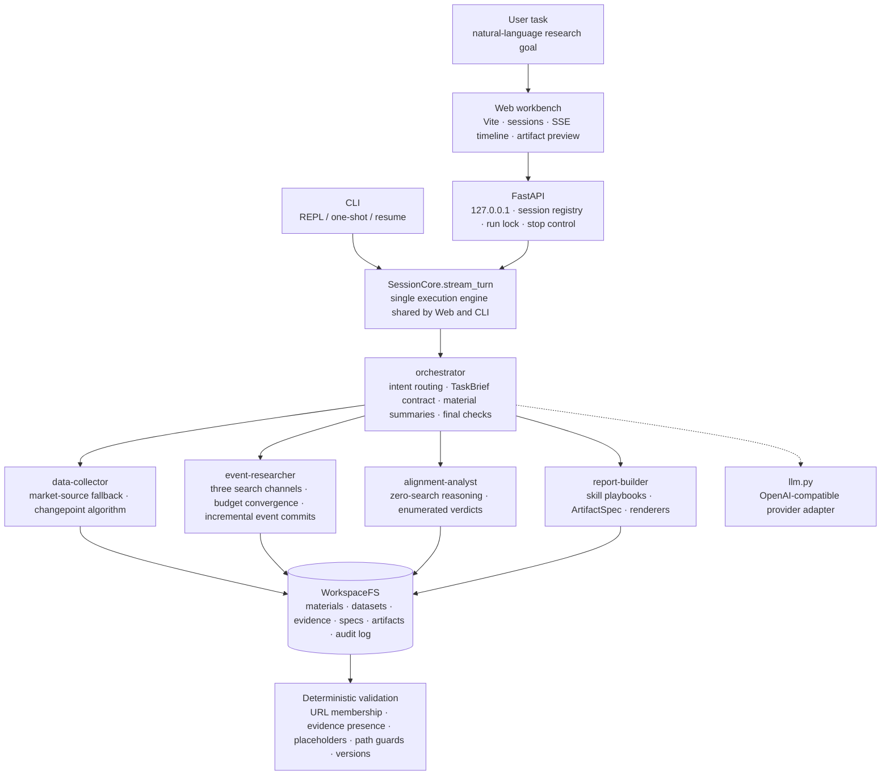

<div align="center">

# finance-agent

**A local-first investment research agent workbench: natural-language tasks → market × event alignment → interactive, traceable research artifacts**

[](https://www.python.org/)
[](https://github.com/openai/openai-agents-python)
[](https://fastapi.tiangolo.com/)
[](https://vitejs.dev/)
[](#security-and-boundaries)
[](#trustworthy-research-guardrails)

[中文](README.md) ｜ **English**

Describe a research goal once, and the system runs the full pipeline:
**market data collection → change-point detection → event research → changepoint × event alignment → artifact generation**.
It produces self-contained interactive HTML, formula-driven Excel workbooks, 16:9 PowerPoint decks, and Word strategy reports.
This is not a thin chat wrapper; it is a complete local agent product with a multi-session web workbench, layered agent orchestration,
an auditable workspace, deterministic validation, repeatable tests, and real sample artifacts.

</div>

---

## Table of Contents

- [Why It Stands Out](#why-it-stands-out)
- [Feature Demo](#feature-demo)
- [System Architecture](#system-architecture)
- [Technical Advantages](#technical-advantages)
- [Quick Start](#quick-start)
- [Usage Examples](#usage-examples)
- [Project Structure](#project-structure)
- [Testing and Quality](#testing-and-quality)
- [Security and Boundaries](#security-and-boundaries)
- [Documentation](#documentation)

## Why It Stands Out

### 1. A complete loop from prompt to research deliverables

finance-agent is built around an actual investment research workflow, not a one-shot Q&A. After the user describes a goal, the agent turns it into an executable chain:

1. collect OHLCV daily market data for equities, futures, and crypto assets;
2. detect trend turns, accelerations, drawdown rebounds, and volume anomalies with deterministic rules;
3. research industry events around each change-point window while preserving URLs, fetch times, excerpts, and the full candidate-link set;
4. independently assess whether each changepoint and event pair is `match`, `partial`, or `none`, without forcing causality;
5. generate HTML / XLSX / PPTX / DOCX artifacts and register every version in the session workspace.

### 2. A tools / subagents / skills architecture

The project is built on the **OpenAI Agents SDK**, but it does not push everything into one long prompt:

| Layer | Role | Implementation in this project |
| --- | --- | --- |
| tools | deterministic capabilities | market data, changepoints, Tavily/HN/Yahoo search, material I/O, artifact rendering |
| subagents | isolated-context judgment units | `data-collector`, `event-researcher`, `alignment-analyst`, `report-builder` |
| skills | methodology and rendering assets | `SKILL.md` plus templates and local Plotly assets, used as reusable artifact-generation playbooks |

Each subagent only receives the tools required for its own responsibility. Conversation memory stays at the orchestrator layer. This lets the model make research judgments while deterministic code owns data access, file writes, and output constraints.

### 3. Trustworthy research guardrails

Core principle: **LLMs make judgments; code owns facts and discipline.**

- **Mandatory provenance**: events, changepoints, conclusions, and artifact blocks all register evidence that can be traced back to market data or news sources;
- **URL membership checks**: event URLs must appear verbatim in retrieved records; fabricated links are rejected before rendering;
- **No handwritten metrics**: Excel uses formulas, HTML charts read cached datasets, and events/changepoints are injected from materials;
- **Placeholder rejection**: `TBD`, `待填`, `formula`, and similar empty-shell output cannot become a final artifact;
- **Append-only versions**: artifact updates use stable `artifact_id + version` history, so every revision remains auditable.

### 4. A local web workbench for long-running tasks

- ChatGPT-style three-column UI: sessions, conversation stream, artifact preview panel;
- parallel sessions with background execution that survives session switching;
- SSE timeline showing each agent's searches, computations, and rendering steps;
- one-click stop that cancels the underlying SDK run;
- settings dialog for the OpenAI-compatible provider triple and Tavily key, persisted to local `.env`;
- multi-turn targeted edits, such as "raise the DeepSeek event rating to high", update the spec and re-render without re-running the entire research pipeline.

## Feature Demo



## System Architecture



### Responsibility Boundaries

| Question | Owner | Why |
| --- | --- | --- |
| Which market points deserve explanation | deterministic algorithm | change-point rules must be reproducible and testable |
| Which events should be researched | LLM + search tools | search direction needs judgment, but retrieval itself must be deterministic |
| Whether an event explains a changepoint | LLM + structured contract | semantic reasoning is useful, but verdicts must stay within controlled enums |
| How files are generated | LLM writes spec + code renders | the model can organize content; code controls file formats and data injection |
| Which artifacts may be written | validation layer | provenance, URLs, placeholders, and path safety cannot rely on prompt discipline |

## Technical Advantages

| Capability | Design | Value |
| --- | --- | --- |
| Context governance | large JSON never enters chat history; materials are stored as `mat-*` IDs and loaded by reference | long research pipelines do not collapse under context growth |
| Reproducible retrieval | Tavily / HN Algolia / Yahoo are deterministic HTTP APIs decoupled from the LLM provider | changing the model does not change retrieved facts |
| Provider compatibility | `llm.py` centralizes `response_format`, tool-message adjacency, `max_tokens`, and related quirks | OpenAI / OpenRouter / DeepSeek / Kimi / self-hosted gateways can be swapped |
| Structured-output recovery | fence stripping, bad-quote repair, truncated-list salvage, event accumulator fallback | weak tool-calling models can still preserve completed research work |
| Auditable workspace | each session stores specs, materials, evidence, artifacts, datasets, and run events under `outputs/<session-id>/` | conclusions and failures can be reconstructed |
| Artifact engineering | ArtifactSpec intermediate representation plus openpyxl / python-pptx / python-docx / Plotly templates | the LLM never writes binary files directly, keeping quality boundaries clear |
| Web concurrency | per-session run locks are bound to task lifecycle; disconnects only stop streaming | refreshes and session switches do not corrupt running agents |

## Quick Start

```bash
# Requirements: uv for Python dependencies + Node.js
# After cloning the repository, enter the project directory
cd finance-agent
uv sync

# Optional: you can also fill these in later from the web settings dialog
cp .env.example .env
# Set OPENAI_API_KEY, optional OPENAI_BASE_URL / FINANCE_AGENT_MODEL, optional TAVILY_API_KEY

# Dev mode: starts backend and frontend together
./scripts/dev.sh
# Open http://127.0.0.1:5173
```

Production mode, where FastAPI serves the built frontend:

```bash
npm --prefix webapp ci
npm --prefix webapp run build
uv run finance-agent --web
# Open http://127.0.0.1:8765
```

Offline mock run without keys:

```bash
FINANCE_AGENT_MOCK=1 uv run finance-agent -p "Analyze NVDA over the past three years and generate an event review"
```

## Usage Examples

In the web workbench, type:

> Review NVIDIA (NVDA) price history over the past five years, curate major AI-industry events of the same period such as ChatGPT, B100, and DeepSeek, mark the main events and impact ratings at each price change-point on an interactive candlestick chart, and generate a traceable HTML report.

Or:

> Build an interactive comparison of gold and bitcoin as safe-haven / inflation-hedge assets, including an Excel backtest workbook, a PowerPoint decision framework, and a Word strategy report.

Then continue with targeted edits:

> Raise the DeepSeek event impact rating to 5 and add a 2025 Q1 drawdown analysis section to the report.

Artifacts can be previewed or downloaded from the right panel and are also written to `outputs/<session-id>/artifacts/`. Real end-to-end sample outputs are available in [`samples/`](samples/).

Optional CLI:

```bash
uv run finance-agent                  # REPL
uv run finance-agent -p "task..."     # one-shot run
uv run finance-agent --list-sessions
uv run finance-agent --resume <session-id>
```

## Configuration

| Variable | Default | Purpose |
| --- | --- | --- |
| `OPENAI_API_KEY` | - | required unless mock mode is enabled |
| `OPENAI_BASE_URL` / `FINANCE_AGENT_BASE_URL` | empty = official OpenAI | OpenAI-compatible gateway, such as OpenRouter, DeepSeek, Kimi, or a self-hosted gateway |
| `FINANCE_AGENT_MODEL` | `gpt-5.5` | model name passed through as-is; OpenRouter models may include provider prefixes |
| `TAVILY_API_KEY` | - | web search; when absent, the agent falls back to HN/Yahoo and reports coverage gaps |
| `FINANCE_AGENT_WEB_MAX_RESULTS` | `5` | result count per web search |
| `FINANCE_AGENT_SEARCH_BUDGET` | `36` | search budget per subagent run |
| `FINANCE_AGENT_MAX_TOKENS` | `200000` | output cap per model call; `0` means do not send the parameter |
| `FINANCE_AGENT_JSON_MODE` | `object` | structured-output mode: `object` / `schema` / `off` |
| `FINANCE_AGENT_MOCK` | - | `1` = fully offline with bundled market seed data and news fixtures |
| `FINANCE_AGENT_SKILLS_DIR` | - | add an external skills directory |

See the [technical documentation](docs/technical.md#4-配置) for the full reference.

## Project Structure

```text
src/finance_agent/
├── cli.py                         # CLI and --web entrypoint
├── config.py                      # Settings + .env persistence
├── llm.py                         # OpenAI-compatible provider adapter
├── session.py                     # SessionCore, history trimming, artifact deltas
├── orchestrator.py                # main orchestration agent
├── subagents/                     # four responsibility-focused subagents
├── tools/                         # market, changepoints, news, web search, agent tools
├── artifacts/                     # ArtifactSpec and HTML/XLSX/PPTX/DOCX renderers
├── skills/builtin/                # built-in artifact skills and template assets
├── workspace.py                   # workspace, provenance, versions, validation, path guards
└── web/app.py                     # FastAPI web service

webapp/                            # Vite + vanilla JS frontend
tests/                             # Python tests + node --test frontend asset tests
samples/                           # real end-to-end sample artifacts
docs/                              # product, technical, architecture, AI development process
outputs/<session-id>/              # local runtime workspace, excluded from git
```

## Testing and Quality

```bash
uv run pytest -q
uv run ruff check .
node --test tests/*.test.cjs
npm --prefix webapp run build      # required after changing webapp/
FINANCE_AGENT_MOCK=1 uv run pytest tests/test_agents.py
```

Quality conventions:

- automated tests do not call the real network or a real LLM;
- real incident fixes become regression tests with a `真实事故：...` note;
- path guards, permission matrices, and secret masking are executable assertions;
- `outputs/` and `.env` are never committed; sample artifacts are explicitly curated under `samples/`.

## Security and Boundaries

Security design:

- the web server binds to `127.0.0.1` and is intended for single-user local use;
- secrets are injected only through environment variables or local `.env`, and settings responses mask them;
- the LLM never receives file paths; tools accept logical IDs such as `artifact_id`, `dataset_id`, and `material_id`;
- all writes go through WorkspaceFS, which derives paths and confines them to the session workspace;
- HTML artifacts are self-contained, Plotly is embedded locally, and external text is escaped before entering HTML.

Known boundaries:

- no remote multi-tenant authentication;
- no investment advice, only research review and evidence organization;
- Yahoo market data uses an unofficial API with fallback but no SLA;
- Chinese financial-news coverage mostly depends on Tavily;
- real-LLM end-to-end regression still requires manual validation, while deterministic layers are covered by tests.

## Documentation

| Document | Contents |
| --- | --- |
| [Product](docs/product.md) | positioning, scenarios, feature list, artifact quality requirements |
| [Technical](docs/technical.md) | stack, code structure, run modes, API, configuration, tests |
| [Architecture](docs/architecture.md) | layering principles, orchestration, context governance, validation, security model |
| [AI-assisted development process](docs/ai-process.md) | AI Coding workflow, key human decisions, integration and validation notes |
| [Sample artifacts](samples/) | two real end-to-end runs with artifacts and provenance indexes |

---

<div align="center">
<sub>finance-agent is a complete local agent product engineering example: the LLM handles judgment; code owns facts, discipline, and deliverable quality.</sub>
</div>
