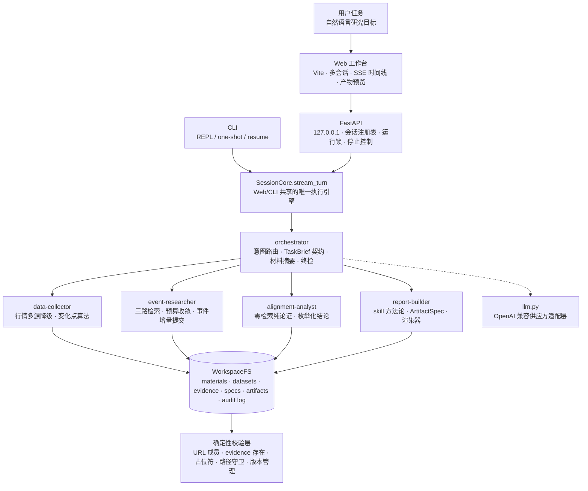

<div align="center">

# finance-agent

**本地优先的投研 Agent 工作台：自然语言任务 → 行情 × 事件对齐分析 → 可交互、可溯源的研究产物**

[](https://www.python.org/)
[](https://github.com/openai/openai-agents-python)
[](https://fastapi.tiangolo.com/)
[](https://vitejs.dev/)
[](#安全与边界)
[](#可信研究防线)

**中文** ｜ [English](README.en.md)

一句话下达研究任务，系统自动完成 **行情采集 → 变化点检测 → 事件研究 → 拐点×事件对齐 → 产物生成**，
输出自包含交互 HTML、全公式 Excel、16:9 PPT 与 Word 策略报告。它不是一个聊天壳，而是一个完整的
Agent 产品工程：有多会话 Web 工作台、有分层 Agent 编排、有可审计工作区、有确定性校验层，也有可复跑的测试与样例产物。

</div>

---
## 功能演示


## 目录

- [项目看点](#项目看点)
- [功能演示](#功能演示)
- [系统架构](#系统架构)
- [技术优势](#技术优势)
- [快速开始](#快速开始)
- [使用示例](#使用示例)
- [项目结构](#项目结构)
- [测试与质量](#测试与质量)
- [安全与边界](#安全与边界)
- [文档](#文档)

## 项目看点

### 1. 从自然语言到投研交付物的完整闭环

finance-agent 面向真实投研工作流，而不是一次性问答。用户描述研究目标后，Agent 会拆解为可执行链路：

1. 获取股票、期货、加密资产的 OHLCV 日线行情；
2. 用确定性算法识别趋势拐头、加速、回撤反弹、量能异常等变化点；
3. 围绕变化点时间窗检索行业事件，保留 URL、抓取时间、摘录与候选链接全集；
4. 独立分析「拐点 × 事件」是否匹配，明确输出 `match / partial / none`，不强行归因；
5. 调用渲染器生成 HTML / XLSX / PPTX / DOCX，并将每个版本登记到会话工作区。

### 2. tools / subagents / skills 三层 Agent 架构

本项目基于 **OpenAI Agents SDK**，但没有把所有事情塞进一个长 prompt：

| 层 | 作用 | 本项目实现 |
| --- | --- | --- |
| tools | 确定性能力 | 行情采集、变化点检测、Tavily/HN/Yahoo 检索、材料读写、产物渲染 |
| subagents | 独立上下文的判断单元 | `data-collector`、`event-researcher`、`alignment-analyst`、`report-builder` |
| skills | 方法论与渲染资产 | `SKILL.md` + 模板 + 本地 Plotly 资源，作为可复用产物生成规范 |

每个 subagent 只持有自己职责内的工具；对话记忆只留在 orchestrator 层。这样既能让模型负责研究判断，又能把事实采集、文件写入、格式约束留给可测试代码。

### 3. 可信研究防线

核心原则：**判断交给 LLM，事实与纪律交给代码。**

- **溯源强制**：事件、拐点、结论与产物 block 都登记 evidence，可逐级回链到原始行情或资讯来源；
- **URL 成员校验**：事件 URL 必须逐字出自检索记录，模型编造链接会在渲染前被拒绝；
- **指标不手写**：Excel 使用公式，HTML 图表数据来自缓存数据集，事件/变化点由材料注入；
- **占位符拒绝**：`TBD`、`待填`、`公式` 等空壳内容不会被渲染成正式产物；
- **版本 append-only**：产物修改走 `artifact_id + version`，历史版本完整保留，便于复盘。

### 4. 面向长任务的本地 Web 工作台

- 类 ChatGPT 三栏界面：会话列表、对话流、产物预览面板；
- 多会话并行运行，切换会话不中断后台任务；
- SSE 实时展示每个 agent 的检索、计算、渲染动作；
- 运行中一键停止，取消会传导到 SDK 运行任务；
- 设置弹窗可配置 OpenAI 兼容供应方三元组与 Tavily Key，并写回本机 `.env`；
- 支持多轮定点修改，例如「把 DeepSeek 事件评级改成高」会更新 spec 并重渲染，不重抓全量数据。


## 系统架构



### 职责边界

| 问题 | 交给谁 | 原因 |
| --- | --- | --- |
| 哪些行情点值得解释 | 确定性算法 | 拐点规则应可复现、可回归测试 |
| 该查什么事件 | LLM + 检索工具 | 研究方向需要判断，检索执行必须确定 |
| 事件是否解释拐点 | LLM + 结构化契约 | 需要语义论证，但结论必须收敛到受控枚举 |
| 文件怎么生成 | LLM 产 spec + 代码渲染 | 内容结构可由模型组织，文件格式与数据注入由代码保证 |
| 什么产物可以落盘 | 校验层 | 溯源、URL、占位符、路径安全不能依赖 prompt 自律 |

## 技术优势

| 能力 | 设计 | 带来的价值 |
| --- | --- | --- |
| 上下文治理 | 大 JSON 不进对话历史，材料落盘为 `mat-*`，下游按引用加载 | 长链路研究不因上下文膨胀而崩掉 |
| 检索可复现 | Tavily / HN Algolia / Yahoo 都是确定性 HTTP API，检索数据与 LLM 供应方解耦 | 换模型不改变已检索事实 |
| 供应方兼容 | `llm.py` 唯一收口 `response_format`、消息邻接、`max_tokens` 等差异 | OpenAI / OpenRouter / DeepSeek / Kimi / 自建网关可切换 |
| 结构化输出容错 | JSON 围栏剥离、坏引号修复、截断打捞、事件累积器兜底 | 弱工具调用模型也能保住已完成研究成果 |
| 可审计工作区 | 每会话独立 `outputs/<session-id>/`，保存 specs、materials、evidence、artifacts、run_events | 能复盘模型如何得到结论，也能定位事故 |
| 产物工程化 | ArtifactSpec 中间表示 + openpyxl / python-pptx / python-docx / Plotly 模板 | LLM 不直接写二进制文件，质量边界更清楚 |
| Web 并发 | 每会话运行锁绑定任务生命周期，断连只停推送不停任务 | 刷新或切会话不会破坏正在运行的 Agent |

## 快速开始

```bash
# 依赖：uv（Python 包管理）+ Node.js
# 克隆仓库后进入项目目录
cd finance-agent
uv sync

# 可选：也可以启动后在 Web 设置弹窗里填写
cp .env.example .env
# 填写 OPENAI_API_KEY、可选 OPENAI_BASE_URL / FINANCE_AGENT_MODEL、可选 TAVILY_API_KEY

# 开发模式：一键启动后端与前端
./scripts/dev.sh
# 打开 http://127.0.0.1:5173
```

生产模式（先构建前端，再由 FastAPI 服务静态页面）：

```bash
npm --prefix webapp ci
npm --prefix webapp run build
uv run finance-agent --web
# 打开 http://127.0.0.1:8765
```

无 key 离线试跑：

```bash
FINANCE_AGENT_MOCK=1 uv run finance-agent -p "分析 NVDA 近三年行情并生成事件复盘"
```

## 使用示例

在 Web 工作台输入：

> 回顾英伟达（NVDA）近五年行情数据，梳理同期 AI 行业大事件（如 ChatGPT 发布、B100、DeepSeek 等），在 K 线图上标记行情变化触发时刻的主要事件与影响评级，生成可交互、可溯源的 HTML。

或：

> 请构建黄金与比特币作为避险/抗通胀资产的可交互比较分析体系，产物包括 Excel 回测底稿、PPT 决策框架、Word 策略报告。

生成后可以继续追问或修改：

> 把 DeepSeek 事件的影响评级改成 5，并在报告里补一段 2025 年 Q1 的回撤分析。

产物会在右侧面板预览/下载，同时落盘到 `outputs/<session-id>/artifacts/`。仓库收录了真实端到端运行样例，见 [`samples/`](samples/)。

CLI 辅助入口：

```bash
uv run finance-agent                  # REPL
uv run finance-agent -p "研究任务..."  # 一次性执行
uv run finance-agent --list-sessions
uv run finance-agent --resume <session-id>
```

## 配置

| 变量 | 默认 | 说明 |
| --- | --- | --- |
| `OPENAI_API_KEY` | - | 必填，除非启用 mock 模式 |
| `OPENAI_BASE_URL` / `FINANCE_AGENT_BASE_URL` | 空 = OpenAI 官方 | OpenAI 兼容网关地址，例如 OpenRouter、DeepSeek、Kimi 或自建网关 |
| `FINANCE_AGENT_MODEL` | `gpt-5.5` | 模型名原样透传；OpenRouter 可使用带厂商前缀的模型名 |
| `TAVILY_API_KEY` | - | 联网检索；未配置时退回 HN/Yahoo 两路并如实声明覆盖不足 |
| `FINANCE_AGENT_WEB_MAX_RESULTS` | `5` | 每次联网检索返回条数 |
| `FINANCE_AGENT_SEARCH_BUDGET` | `36` | 单次 subagent 运行的检索预算 |
| `FINANCE_AGENT_MAX_TOKENS` | `200000` | 单次调用输出上限；`0` 表示不发送该参数 |
| `FINANCE_AGENT_JSON_MODE` | `object` | 结构化输出策略：`object` / `schema` / `off` |
| `FINANCE_AGENT_MOCK` | - | `1` = 完全离线，使用内置行情种子与资讯夹具 |
| `FINANCE_AGENT_SKILLS_DIR` | - | 追加外部 skill 目录 |

更多细节见 [技术文档](docs/technical.md#4-配置)。

## 项目结构

```text
src/finance_agent/
├── cli.py                         # CLI 与 --web 入口
├── config.py                      # Settings + .env 写回
├── llm.py                         # OpenAI 兼容供应方适配层
├── session.py                     # SessionCore、历史修剪、产物增量
├── orchestrator.py                # 主编排 agent
├── subagents/                     # 四个职责清晰的 subagent
├── tools/                         # 行情、变化点、资讯、联网检索、agent tools
├── artifacts/                     # ArtifactSpec 与 HTML/XLSX/PPTX/DOCX 渲染器
├── skills/builtin/                # 四个内置产物 skill 与模板资产
├── workspace.py                   # 工作区、溯源、版本、校验、路径守卫
└── web/app.py                     # FastAPI Web 服务

webapp/                            # Vite + 原生 JS 前端
tests/                             # Python 单测 + node --test 前端资产测试
samples/                           # 真实端到端样例产物
docs/                              # 产品、技术、架构、AI 开发过程
outputs/<session-id>/              # 本地运行时工作区（不入库）
```

## 测试与质量

```bash
uv run pytest -q
uv run ruff check .
node --test tests/*.test.cjs
npm --prefix webapp run build      # 修改 webapp/ 后必须执行
FINANCE_AGENT_MOCK=1 uv run pytest tests/test_agents.py
```

质量约定：

- 自动化测试不调用真实网络与真实 LLM；
- 真实事故修复会沉淀为带「真实事故：...」说明的回归测试；
- 路径守卫、权限矩阵、密钥打码等安全设计写成可执行断言；
- `outputs/` 和 `.env` 永不入库，样例产物只通过 `samples/` 显式收录。

## 安全与边界

安全设计：

- Web 服务仅绑定 `127.0.0.1`，定位为单用户本地工作台；
- 密钥只通过环境变量或本机 `.env` 注入，设置接口外发时打码；
- LLM 永远拿不到文件路径，工具参数只接受 `artifact_id`、`dataset_id`、`material_id` 等逻辑标识；
- 所有文件写入经 WorkspaceFS 派生路径并限制在会话工作区内；
- HTML 产物自包含，Plotly 本地内嵌，外部文本进入 HTML 前全部转义。

已知边界：

- 不提供远程多租户鉴权；
- 不构成投资建议，只做研究复盘与证据整理；
- Yahoo 行情为非官方接口，有多源降级但无 SLA；
- 中文财经资讯覆盖主要依赖 Tavily；
- 真实 LLM 端到端回归仍需人工验收，确定性层由单测覆盖。

## 文档

| 文档 | 内容 |
| --- | --- |
| [产品文档](docs/product.md) | 定位、场景、功能清单、产物质量要求 |
| [技术文档](docs/technical.md) | 技术栈、代码结构、运行方式、API、配置、测试 |
| [架构文档](docs/architecture.md) | 分层原则、编排模式、上下文治理、确定性校验、安全模型 |
| [AI 辅助开发过程](docs/ai-process.md) | AI Coding 工作流、关键人工判断、联调与验收过程 |
| [样例产物](samples/) | 两组真实端到端运行结果与溯源索引 |

---

<div align="center">
<sub>finance-agent 是一个完整的本地 Agent 产品工程样例：LLM 负责判断，代码负责事实、纪律与可交付质量。</sub>
</div>
