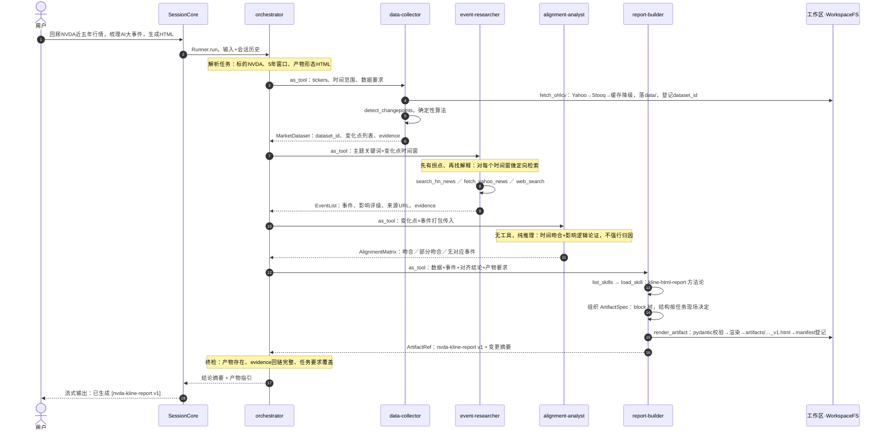
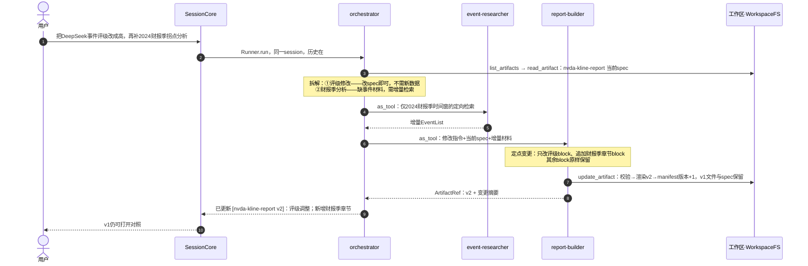
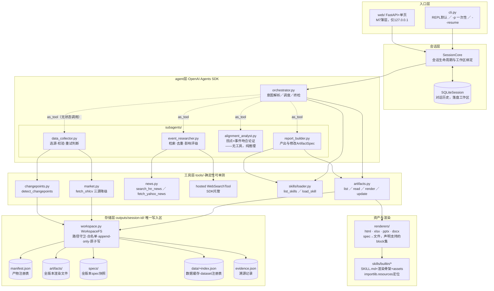

# 运行流程与架构图解

> 版本 v1.0 ｜ 2026-07-03 ｜ 配套 [prd.md](prd.md)、[tech-design.md](tech-design.md)
> 回答三个问题：用户输入之后系统怎么流转（§2 时序图）、代码框架长什么样（§3 架构图）、每个 agent 有哪些工具/输入/输出、为什么这么配（§4–§5）。GitHub / VS Code 可直接渲染 Mermaid。

## 1. 一次输入的生命周期（概览）

无论 REPL、`-p` 一次性还是 Web 界面，输入都汇到同一个 `SessionCore`，流程恒定为：

```
用户输入 → SessionCore（挂载 SQLiteSession 对话历史）
        → Runner.run(orchestrator)          ← SDK 的 agent 循环
        → orchestrator 判断意图：新建研究 or 修改既有产物
        → 按需调度 4 个 subagent（as_tool 方式，每次调用都是无状态的独立运行）
        → 产物落盘工作区（经 WorkspaceFS），manifest 登记版本
        → 回复用户：结论 + [artifact_id vN] + 文件路径
```

两个关键事实，后面所有图都建立在这之上：

- **对话记忆只在 orchestrator 一层**。subagent 每次被调用都是全新上下文（无状态），它们需要的信息全部由 orchestrator 在调用参数里显式传入——这就是"上下文隔离"的落地方式。
- **只有工具能碰文件系统**，且全部经 WorkspaceFS 禁闭在 `outputs/<session-id>/` 内；agent（含 orchestrator）手里没有任何通用文件读写能力。

## 2. 时序图

### 2.1 场景：新建产物（以任务一 NVDA 为例）



要点批注（编号对应图中步骤）：

- **步骤 3–6**：数据采集内部的降级链选择、数据质量校验后是否重试是 data-collector 的判断；但抓取与拐点计算本身是确定性工具，输出天然带 evidence。
- **步骤 7–9**：event-researcher 拿到的不是"去搜 AI 大事件"，而是**具体的变化点日期窗口**——检索是带着问题去的，这是"事件与拐点吻合"的机制保证。
- **步骤 10–12**：alignment-analyst 没有任何工具，是纯推理单元。给它工具反而有害：它的职责是基于既有证据做严谨论证，不是继续找料（找料是 event-researcher 的事，职责单一）。
- **步骤 13–17**：report-builder 是唯一能落产物的 agent，但它也只能通过 render_artifact 间接写盘——spec 不过校验就没有产物，写坏文件这条路不存在。

### 2.2 场景：多轮对话，定点修改既有产物



修改流程的三个设计保证：

1. **不重抓数据**——行情缓存在工作区 `data/`，评级修改这类请求全程不碰网络；
2. **定点生效**——改的是 spec 里的目标 block，"改 A 不动 B"有单测看护；
3. **可审计**——v1/v2 的 spec diff 就是改动记录，manifest 里的 change_summary 是人话版。

### 2.3 意图路由：不是每次输入都走全链

链路不是硬编码流程，只是 orchestrator 手里的工具——不需要就不调。orchestrator prompt 显式定义四类意图与响应路径：

| 意图 | 判定示例 | 响应路径 | 成本 |
|---|---|---|---|
| 新建研究 | "回顾NVDA近五年行情…生成HTML" | 全链：采集→研究→对齐→成文（§2.1） | 高（网络+多轮LLM） |
| 修改产物 | "把DeepSeek评级改成高" | read_artifact→定点变更→重渲染（§2.2）；仅材料缺口才补检索 | 低—中 |
| 咨询既有产物 | "为什么ChatGPT那次评级是高？" | read_artifact 读 spec/evidence 直接作答，**零 subagent 调用** | 极低 |
| 无关话题/超出能力 | 闲聊、"帮我写个爬虫" | 直接回应或说明能力边界，**不调任何工具** | 极低 |

**防误触发规则**（写入 prompt）：数据采集与检索是昂贵动作——意图不明时先向用户澄清（标的？时间范围？产物形态？），不凭猜测启动采集链；咨询类问题优先用工作区已有材料回答，答不了再提议"是否需要我做一轮新研究"。

## 3. 架构图（代码框架与调用关系）



读图要点：

- **虚线 = as_tool 调用**：subagent 对 orchestrator 而言就是一个工具；每次虚线触发，SDK 内部为该 subagent 起一轮独立的 agent 循环（自己的 prompt、自己的工具、跑完即弃）。
- **L4 是唯一有副作用的层**，且写盘动作全部汇到 WorkspaceFS 单点；L3 的 agent 只做判断与编排。
- **alignment-analyst 没有指向 L4 的任何连线**——这是刻意的（见 §4）。
- L5 渲染器被 artifacts.py 调用而非被 agent 直接调用：agent 给的是 spec（逻辑描述），文件名、路径、资产复制全部由系统派生。

## 4. Agent 档案卡

### orchestrator（主 agent）

| 项 | 内容 |
|---|---|
| 职责 | 意图解析（新建研究 or 修改产物）、任务拆解、subagent 调度、结果终检、面向用户的回复 |
| 模型 | gpt-5.5 |
| 工具 | 4 个 subagent（as_tool）＋ `list_skills`、`list_artifacts`、`read_artifact` |
| 输入 | 用户消息 + SQLiteSession 对话历史 + skill 索引（frontmatter 常驻 prompt） |
| 输出 | 面向用户的自然语言回复（引用 `[artifact_id vN]`） |
| prompt 要点 | 四类意图路由（§2.3），不需要的链路一步都不调；意图不明先澄清再动手，不凭猜测启动昂贵的采集链；修改类请求先查 manifest 定位目标产物；能用缓存数据就不重抓；终检清单（产物存在、evidence 完整、任务要求逐条覆盖）；诚实原则（数据缺失/事件未找到要明说） |
| 为什么它不直接干活 | 它是唯一带对话记忆的 agent，上下文要留给"理解用户"；检索的脏上下文、论证的长推理都下放隔离 |

### data-collector

| 项 | 内容 |
|---|---|
| 职责 | 行情数据采集与质量把关、变化点检测的触发 |
| 工具 | `fetch_ohlcv`、`detect_changepoints` |
| 输入（调用参数） | tickers、时间范围、数据粒度要求 |
| 输出（output_type） | `MarketDataset`：dataset_id、覆盖区间、实际命中源、行数、变化点列表、evidence ids |
| 判断点 | 降级链失败后的重试/换源决策；数据质量校验（行数异常、区间缺口）后是否接受 |
| 为什么独立 | 采集含多轮"尝试→校验→决策"，过程性内容多；隔离后 orchestrator 只见结论 |

### event-researcher

| 项 | 内容 |
|---|---|
| 职责 | 围绕变化点时间窗做定向资讯检索，去重、筛选大事件、影响评级 |
| 工具 | `search_hn_news`、`fetch_yahoo_news`、`web_search`（hosted） |
| 输入 | 主题关键词、标的、变化点时间窗列表（或修改场景下的指定缺口窗口） |
| 输出 | `EventList`：[{date, title, summary, impact_rating, direction, source_urls, evidence_ids}] |
| 判断点 | 三路结果的交叉验证与去重；评级论证；某窗口检索无果时如实返回空 |
| 为什么独立 | 上下文最脏的环节——几十条检索结果进出，绝不能让这些污染主线程；也是最可能需要多轮工具调用的环节 |

### alignment-analyst

| 项 | 内容 |
|---|---|
| 职责 | 变化点 × 事件的吻合性论证，产出对齐矩阵 |
| 工具 | **无** |
| 输入 | 变化点列表 + EventList（orchestrator 打包传入） |
| 输出 | `AlignmentMatrix`：[{changepoint, matched_events, verdict∈{吻合,部分,无对应}, reasoning, evidence_ids}] |
| 判断点 | 时间窗吻合度、影响方向与行情方向的一致性、多事件竞争解释时的取舍 |
| 为什么无工具 | 职责是"基于既有证据论证"，不是"继续找料"；无工具=推理不会被新检索打断，输出只依赖输入，可复现性最好。找料缺口由它在 reasoning 里声明，orchestrator 决定是否补一轮 event-researcher |

### report-builder

| 项 | 内容 |
|---|---|
| 职责 | 选 skill、组织/修改 ArtifactSpec、触发渲染，撰写 change_summary |
| 工具 | `list_skills`、`load_skill`、`list_artifacts`、`read_artifact`、`render_artifact`、`update_artifact` |
| 输入 | 新建：全部分析材料+产物要求；修改：修改指令+当前 spec+增量材料 |
| 输出 | `ArtifactRef`：artifact_id、version、file、change_summary |
| 判断点 | 产物结构设计（几章/几页/哪些 sheet）、叙事撰写、重点事件取舍、修改时的最小变更范围 |
| 为什么独立 | 成文需要吞下全部材料+完整 skill 方法论，上下文大；且它是唯一有"写"能力的 agent，权限收口在一处 |

## 5. 工具 × Agent 权限矩阵

| 工具 | orchestrator | data-collector | event-researcher | alignment-analyst | report-builder |
|---|:---:|:---:|:---:|:---:|:---:|
| subagent × 4（as_tool） | ✅ | — | — | — | — |
| `fetch_ohlcv` | — | ✅ | — | — | — |
| `detect_changepoints` | — | ✅ | — | — | — |
| `search_hn_news` | — | — | ✅ | — | — |
| `fetch_yahoo_news` | — | — | ✅ | — | — |
| `web_search`（hosted） | — | — | ✅ | — | — |
| `list_skills` | ✅ | — | — | — | ✅ |
| `load_skill` | — | — | — | — | ✅ |
| `list_artifacts` | ✅ | — | — | — | ✅ |
| `read_artifact` | ✅ | — | — | — | ✅ |
| `render_artifact` | — | — | — | — | ✅ |
| `update_artifact` | — | — | — | — | ✅ |

矩阵本身就是安全边界的一部分：**每个 agent 只拿完成本职所需的最小工具集**；"写产物"只存在于 report-builder，"碰网络"只存在于 data-collector 与 event-researcher，alignment-analyst 两者皆无。

## 6. SDK 运行机制（实现者须知）

- **Runner 循环**：`Runner.run(orchestrator, input, session=…)` 驱动主循环——模型产出 → 若含 tool call 则执行工具/子 agent → 结果回填 → 再进模型，直至产出最终回复或触达 `max_turns` 护栏。
- **as_tool 的嵌套语义**：`subagent.as_tool(name, description)` 把整个子 agent 包装成一个工具。orchestrator 调用它时，SDK 在内部为 subagent 起**独立的 Runner 循环**（自己的 system prompt、自己的工具、干净上下文），跑完把最终输出作为 tool result 返回。subagent 之间不能互相调用——调度权只在 orchestrator。
- **会话记忆**：`SQLiteSession` 只挂在 orchestrator 的 Runner 上；subagent 每次调用无历史。跨轮信息（"上次那个报告"）由 orchestrator 从会话历史 + manifest 恢复，再显式传参给 subagent。
- **结构化输出**：subagent 一律声明 `output_type`（pydantic：MarketDataset / EventList / AlignmentMatrix / ArtifactRef），SDK 强制 schema——环节间不传自由文本，漂移在源头拦截。
- **mock 模式**：`FINANCE_AGENT_MOCK=1` 时工具层换为录制数据实现，agent 层不感知——集成测试跑全流水线不烧 API。
- **护栏**：每层 Runner 设 `max_turns`；工具抛结构化错误时，重试决策在持有该工具的 subagent，orchestrator 只见最终成败与原因。

## 7. 模块与文件对照

| 模块 | 文件 | 里程碑 |
|---|---|---|
| 入口 | `src/finance_agent/cli.py` | M0 骨架已有，M3 补 REPL/--resume |
| 配置 | `src/finance_agent/config.py` | M0 已有 |
| 会话/工作区/文件守卫 | `src/finance_agent/workspace.py`（SessionCore、WorkspaceFS、manifest） | M3 |
| 工具层 | `src/finance_agent/tools/{market,news,changepoints,artifacts}.py` | M1（artifacts 在 M3） |
| skill 机制 | `src/finance_agent/skills/loader.py` + `builtin/*/` | M2 |
| spec 与渲染 | `src/finance_agent/artifacts/{spec.py,renderers/}` | M2（html）/ M6（office 三件套） |
| 溯源 | `src/finance_agent/provenance.py` | M1 |
| agent 层 | `src/finance_agent/orchestrator.py`、`subagents/*.py` | M4 |
| Web 薄层 | `src/finance_agent/web/` | M7 |
